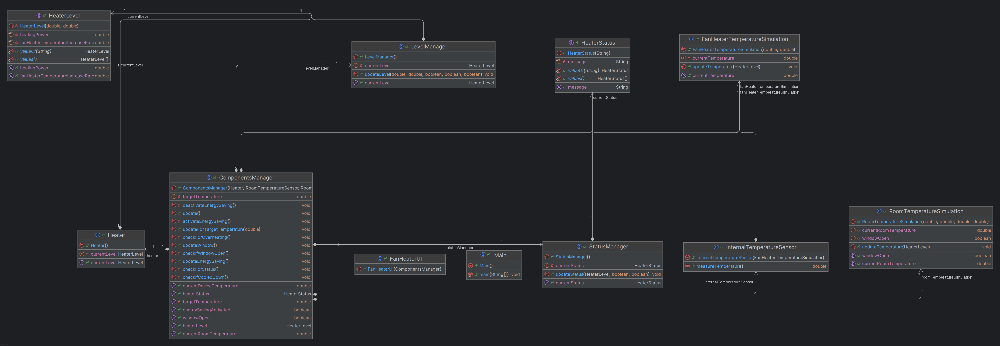

# Design

## Klassendiagramm

Das Klassendiagramm wurde mit IntelliJ Idea Diagramm Generierung nach der finalen Implementierung
der ersten Iteration erzeugt. Dabei wurden sowohl die public als auch die privaten Methoden und
Variablen eingeblendet, um den Zusammenhang zwischen den Klassen besser sichtbar zu machen.

Im Vergleich zum ersten Diagramm sind zwei weitere Manager für das [Level](../fanheater/src/manager/LevelManager.java) und [Status](../fanheater/src/manager/StatusManager.java) hinzugekommen, um die Logik übersichtlicher zu halten. Zudem kam eine [Simulation der Gerätetemperatur](../fanheater/src/simulation/FanHeaterTemperatureSimulation.java) und der entsprechende [Sensor](../fanheater/src/sensor/InternalTemperatureSensor.java) hinzu. Alle weitern Klassen wurden vom Umfang erweitert und mit den neuen nach Bedarf verknüpft.

