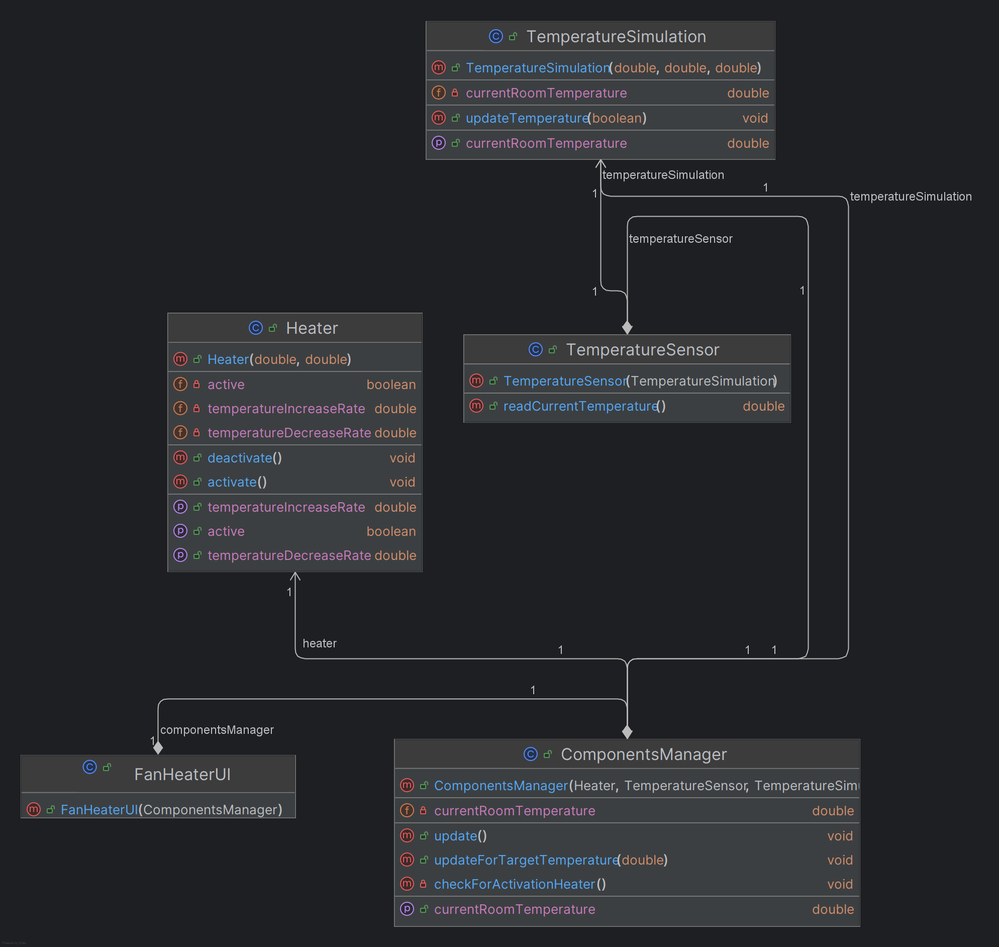

# Design 

## Klassendiagramm

Das Klassendiagramm wurde mit IntelliJ Idea Diagramm Generierung nach der finalen Implementierung
der ersten Iteration erzeugt. Dabei wurden sowohl die public als auch die privaten Methoden und
Variablen eingeblendet, um den Zusammenhang zwischen den Klassen besser sichtbar zu machen.

<<<<<<<< HEAD:out/production/Temperaturregler/Iteration1/Design1.md

========

>>>>>>>> e8be0b7 (transferred final state from se repository):Iterations/Iteration 1/Link to SW Architecture & Design/Design1.md
