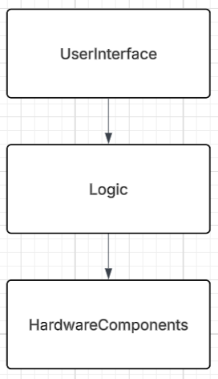

# Architektur

## Architekturmodell

### Schichtenmodell

- Aufgaben klar aufteilen (Benutzeroberfläche, Logik, Heizen, Temperatur messen)
- gute Test- und Wartbarkeit der einzelnen Schichten
- jede Schicht darf nur auf die darunterliegende zugreifen

## Komponentendiagramm

### Verantwortlichkeiten der Komponenten

| **Komponente**     | **Rolle**                  | **Verantwortlichkeiten**                           |
|--------------------|----------------------------|----------------------------------------------------|
| UserInterface      | Präsentationsschicht       | Tempraturanzeige, User-Interaktionen               |
| Logic              | Business-Logik             | Heater (de-)aktivieren, User-Interaktionen handeln |
| HardwareComponents | Hardware-Interface         | Zugriff auf Sensoren / Simulatoren                 |

## Technologiestack

| Kategorie                | Technologie / Tool | Begründung                                                       |
|--------------------------|--------------------|------------------------------------------------------------------|
| Sprache                  | Java Temurin 21    | familiärität, persönliche Erfahrung                              |
| Buildsystem              | Maven              | kein Build                                                       |
| Versionskontrolle        | Git + GitHub       | Standard                                                         |
| IDE                      | IntelliJ Idea      | Übersichtlich, modular                                           |
| Ausgabe                  | Konsole  + Swing   | Einfache, fast responsive Lösung                                 |
| Dokumentation            | Markdown           | Einfache und schnelle Dokumentation + gute Anbindung in IntelliJ |
| Codeanalyse              | Sonar Qube         | IntelliJ Idea Plugin, einfache Bedienung                         |
| Test-Framework           | JUnit 4/5          | Standard für Java, einfach, erweiterbar                          |
| KI¹                      | ChatGPT + Claude   | Gute Formulierungen und Quellen                                  |

¹KI wurde im Rahmen dieses Projekts ausschließlich für die Formulierung der Dokumentation, der Javadoc Kommentare, das übersichtliche Gestalten des Codes und die UI benutzt
