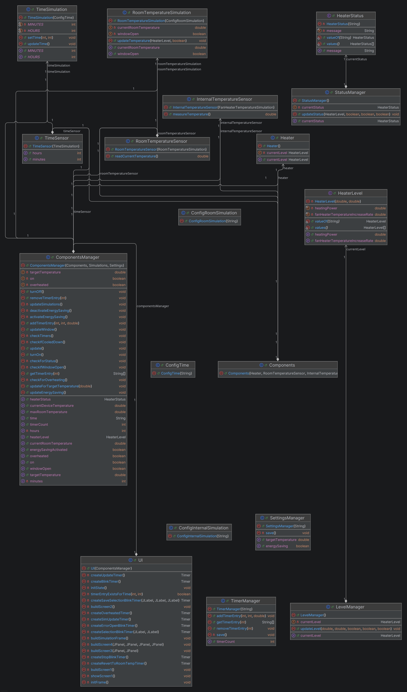

# Design

## Klassendiagramm

Das Klassendiagramm wurde mit IntelliJ Idea Diagramm Generierung nach der finalen Implementierung
der Iteration erzeugt. Dabei wurden sowohl die public als auch die privaten Methoden und
Variablen eingeblendet, um den Zusammenhang zwischen den Klassen besser sichtbar zu machen.

Im Vergleich zum vorherigen Klassendiagramm kamen in diesem 2 neue Manager (`SettingManager`, `TimerManager`), ein weiterer Simulator (`TimeSimulation`) mit passendem Sensor (`TimeSensor`) sowie mehrere Config Klassen (`Components`, `ConfigInternalSimulation`, `ConfigTime`, `ConfigRoomSimulation`, `Settings`, `Simulations`) mit passenden Properties Dateien hinzu.

